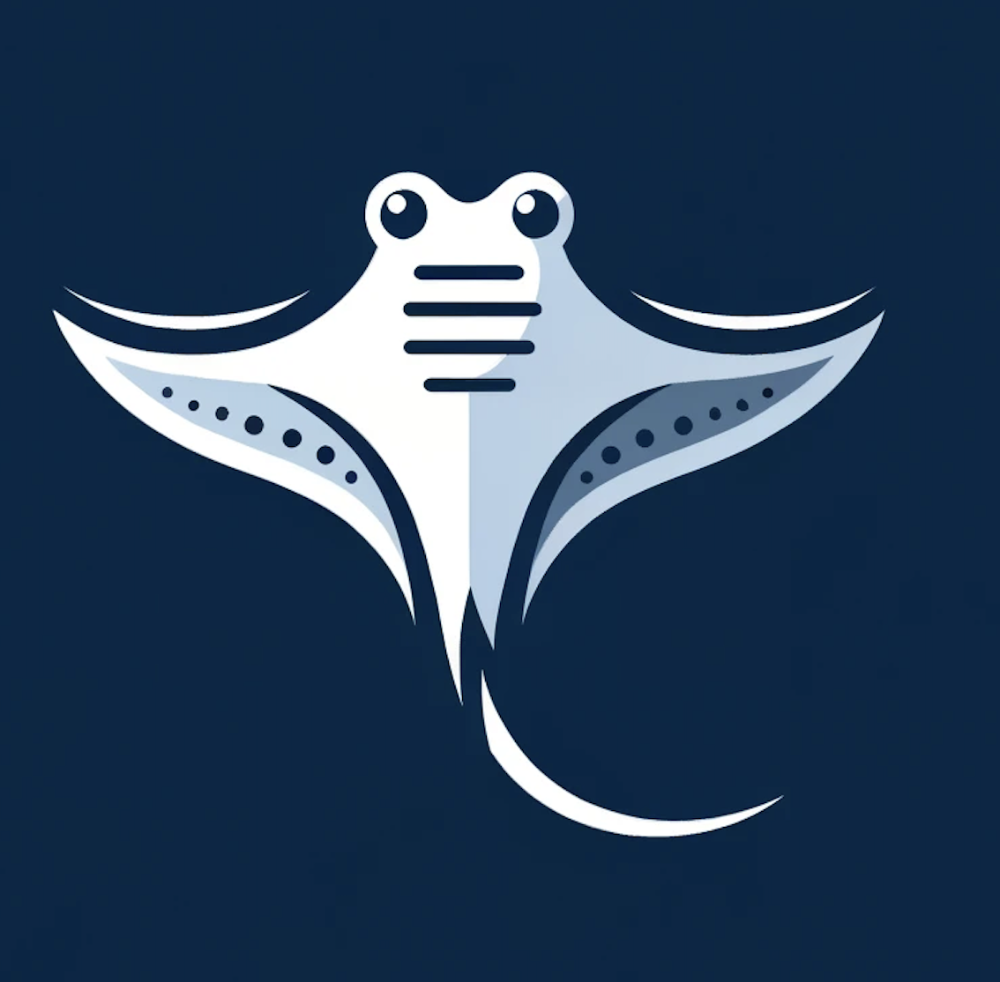

# Mobula

---

This is one of my toy projects. It is a simple VCS (Version Control System) written in different programming languages. I chose this kind of project because I wanted to avoid the typical "To-Do" app or something similar.

This program was written to learn the difference between several languages through the same program. Including:

**Fundamentals:** variable declaration and manipulation, screen output, keyboard input, loops, if statements, file input, file output, etc

**Specific programming language features:** dependency management, pattern matching, debuggers, unit testing, etc

**More complex topics** Cryptography libraries to hash the contents of the files.

Inspired by: https://medium.com/@musicalchemist/building-a-simple-version-control-system-with-python-e5724460496b

---

## Work in Progress

Python is the language that I've been working with for the last 10 years (maybe?), so I won't include Python in the list.

* Rust
* C++
* C
* AWK
* Perl
* TypeScript
* Zig
* Scala

## Features

**init:** Initialize the config file named *.mantaray_config*.

**commit:** Save the content of the files in a hash.

**revert:** Go to a previous hash content.

Maybe I'll add more complexity over time. For now, I'll keep it simple to learn the fundamentals in the languages that I'm interested in learning.

## How to use.

The repository is organized per programming language. Under each programming language directory, you'll find the code and a small README.
